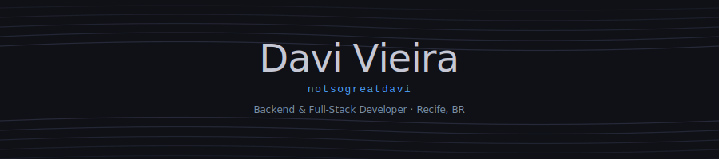
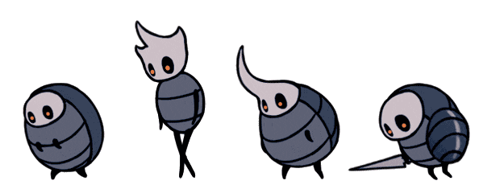

  

  

 

  

 

  
  &nbsp;
  

---

## About

> *"My path is mine to walk."* — Hornet

Backend and full-stack developer with 1+ year of internship experience and active participation in a Junior Enterprise. Currently studying Information Systems at UFRPE (7th semester) and building mandaca-backend, a production-oriented event management API. Research background in Computer Vision through Undergraduate Research at UFRPE.

---

## Featured Projects

> *"I fear only that my work will be forgotten."* — The Nailsmith

<table>
  <tr>
    <td width="50%" valign="top">
      <h3><a href="https://github.com/Mandaca-App/mandaca-backend">mandaca-backend</a></h3>
      
REST API for the Mandaca platform, built with FastAPI and Supabase, with Alembic migrations and auto-generated OpenAPI documentation.

      
      
      
      
    </td>
    <td width="50%" valign="top">
      <h3><a href="https://github.com/notsogreatdavi/habits.sh">habits.sh</a> 🚧</h3>
      
Browser-based habit tracker with a terminal aesthetic, built with Next.js and TypeScript, running entirely on localStorage with no server required.

      
      
      
    </td>
  </tr>
  <tr>
    <td width="50%" valign="top">
      <h3><a href="https://github.com/notsogreatdavi/GeometriesAirQuality">Geometries Air Quality</a></h3>
      
Air quality monitoring across UFRPE and UFPE campuses, analyzing CO2, HCHO and VOC readings from 480+ sensor measurements using statistical and cellular automata modeling.

      
    </td>
    <td width="50%" valign="top">
      <h3><a href="https://github.com/notsogreatdavi/DIGAI">DIGAI</a> 🚧</h3>
      
Gesture and body articulation recognition system using OpenCV, developed as Undergraduate Research (IC) at UFRPE.

      
      
      
    </td>
  </tr>
</table>

---

## Skills

> *"A master of the nail must first master himself."* — Nailmaster Mato

**Backend**

**Frontend**

---

## GitHub Stats

  
  

---

## Research

> *"In the kingdom of silence, the mind speaks loudest."*

Computer Vision research through Undergraduate Research at UFRPE, working on image processing and object detection pipelines.

